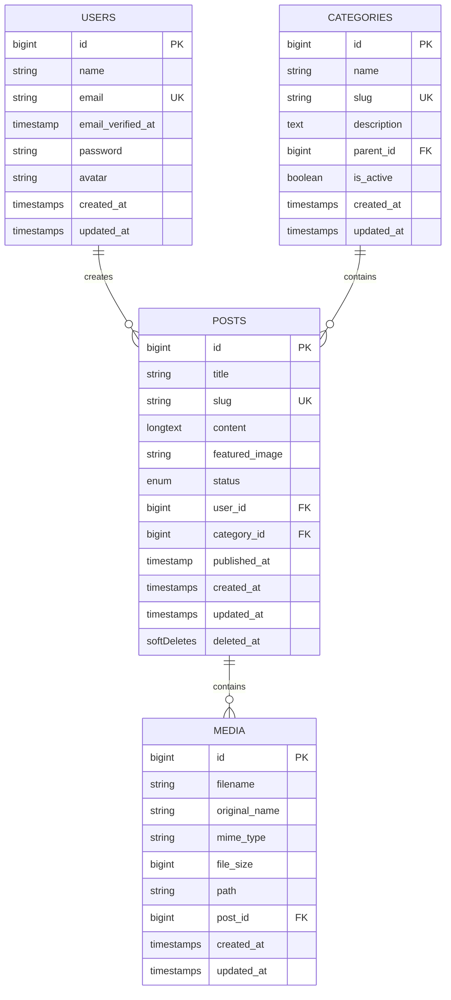

```mermaid
erDiagram
    USERS ||--o{ POSTS : creates
    CATEGORIES ||--o{ POSTS : contains
    POSTS ||--o{ MEDIA : contains

    USERS {
        bigint id PK
        string name
        string email UK
        timestamp email_verified_at
        string password
        string avatar
        timestamps created_at
        timestamps updated_at
    }

    CATEGORIES {
        bigint id PK
        string name
        string slug UK
        text description
        bigint parent_id FK
        boolean is_active
        timestamps created_at
        timestamps updated_at
    }

    POSTS {
        bigint id PK
        string title
        string slug UK
        longtext content
        string featured_image
        enum status
        bigint user_id FK
        bigint category_id FK
        timestamp published_at
        timestamps created_at
        timestamps updated_at
        softDeletes deleted_at
    }

    MEDIA {
        bigint id PK
        string filename
        string original_name
        string mime_type
        bigint file_size
        string path
        bigint post_id FK
        timestamps created_at
        timestamps updated_at
    }

```